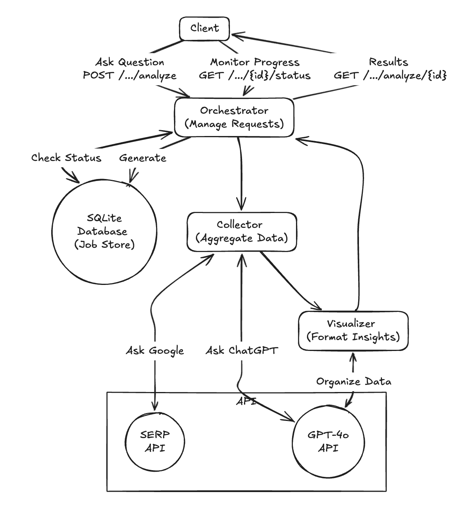

# 🚀 LLM Search Insights

<div align="center">


[](https://github.com/SUKESH127-art/LLM-Search-Insights-Web-UI/pulls)
[](https://opensource.org/licenses/MIT)

*Generate LLM search insights & visualizations!*

</div>

---

## ✨ Features

<div align="center">

### 📝 Simulate & Analyze Customers LLM Search Queries


### 🔍 Generate Google SEO Analysis & LLM Visibility Insight Report


### 📊 Compare and Contrast Market Leaders


</div>

### 🎯 **Key Insights Include**
- **🔍 Google SEO Analysis**: Marketer-oriented brand visibility report based off of top Google results as well as what these brands are known for. 
- **🤖 ChatGPT's Actual Response**: AI-generated answer to query  
- **📈 Data Visualization**: Interactive charts showing top 5 LLM-visible brands with methodology.

---

## 🏗️ System Architecture

### 🔧 Backend Architecture
The backend follows a microservices architecture with asynchronous job processing, web scraping capabilities, and AI-powered analysis synthesis. Check out the **[Backend GitHub Repo](https://github.com/SUKESH127-art/LLM-search-insights-api)**!

<div align="center">



</div>

---

## 📁 Project Structure

```bash
llm-search-insight-web-app/
├── src/
│   ├── app/                    # Next.js app router
│   │   ├── api/               # API routes
│   │   ├── globals.css        # Global styles
│   │   ├── layout.tsx         # Root layout
│   │   ├── page.tsx           # Home page
│   │   ├── providers.tsx      # Context providers
│   │   └── tailwind-input.css # Tailwind source
│   ├── components/             # React components
│   │   ├── ui/                # Reusable UI components
│   │   │   ├── accordion.tsx  # Accordion component
│   │   │   ├── alert.tsx      # Alert component
│   │   │   ├── badge.tsx      # Badge component
│   │   │   ├── button.tsx     # Button component
│   │   │   ├── card.tsx       # Card component
│   │   │   ├── input.tsx      # Input component
│   │   │   ├── progress.tsx   # Progress component
│   │   │   ├── skeleton.tsx   # Skeleton component
│   │   │   └── tooltip.tsx    # Tooltip component
│   │   ├── AnalysisResults.tsx # Main results display
│   │   ├── BrandChart.tsx     # Brand visualization
│   │   ├── LoadingState.tsx   # Loading indicators
│   │   └── SearchInterface.tsx # Search form
│   ├── hooks/                  # Custom React hooks
│   │   └── useAnalysis.ts     # API integration hook
│   └── lib/                    # Utility functions
│       ├── parser.ts           # Text parsing utilities
│       └── utils.ts            # General utilities
├── public/                      # Static assets
│   ├── file.svg                # File icon
│   ├── globe.svg               # Globe icon
│   ├── next.svg                # Next.js logo
│   ├── vercel.svg              # Vercel logo
│   └── window.svg              # Window icon
├── media/                       # Project screenshots
├── components.json              # shadcn/ui configuration
├── next.config.ts               # Next.js configuration
├── tailwind.config.js           # Tailwind CSS configuration
├── tsconfig.json                # TypeScript configuration
└── package.json                 # Dependencies and scripts
```

---

## 🔌 LLM Insights API

### 🚀 Get Started
- **[Render's Live Docs](https://llm-search-insights-api.onrender.com/docs)**
- **[OpenAPI Spec](https://llm-search-insights-api.onrender.com/openapi.json)**

### 📡 Endpoints

<div align="center">

| 🔄 **Generate Insight** | 📊 **Poll Job Status** | 🎯 **See Results** |
|:---:|:---:|:---:|
| `POST /api/v1/analyze` | `GET /api/v1/analyze/{analysis_id}/status` | `GET /api/v1/analyze/{analysis_id}` |

</div>

### 💻 Example Usage

```bash
# Submit analysis
curl -X POST 'https://llm-search-insights-api.onrender.com/api/v1/analyze' \
  -H 'Content-Type: application/json' \
  -d '{"research_question": "What are the best programming languages for AI?"}'

# Check status
curl 'https://llm-search-insights-api.onrender.com/api/v1/analyze/{analysis_id}/status'

# Get results
curl 'https://llm-search-insights-api.onrender.com/api/v1/analyze/{analysis_id}'
```

---

## 📊 Data Models

### 🏗️ Core Schemas

<div align="center">

| 📋 **Schema** | 📝 **Description** |
|:---:|:---:|
| `FullAnalysisResult` | Main analysis report container |
| `WebAnalysis` | Web scraping results and confidence scores |
| `ChatGPTResponse` | AI-generated responses and brand identification |
| `VisualizationData` | Chart data and methodology explanations |

</div>

#### 🔍 `FullAnalysisResult`
- `analysis_id` (string)
- `research_question` (string) 
- `status` (string): `QUEUED` • `PROCESSING` • `SCRAPING` • `SYNTHESIZING` • `COMPLETE` • `ERROR`
- `completed_at` (string, date-time)
- `web_results` (WebAnalysis object)
- `chatgpt_simulation` (ChatGPTResponse object)
- `visualization` (VisualizationData object)

#### 🌐 `WebAnalysis`
- `content` (string)
- `confidence_score` (number)

#### 🤖 `ChatGPTResponse`
- `simulated_response` (string)
- `identified_brands` (array of strings)

#### 📈 `VisualizationData`
- `title` (string)
- `brand_scores` (array of BrandVisibilityScore objects)
- `methodology_explanation` (string)

---

## 🚀 Getting Started

### 📋 Prerequisites
- **Node.js** 18+ 
- **npm**, **yarn**, **pnpm**, or **bun**

### ⚡ Quick Start

```bash
# 1. Clone and install dependencies
git clone <your-repo-url>
cd llm-search-insight-web-app
npm install

# 2. Run dev server
npm run dev

# 3. Open browser: http://localhost:3000
```

<div align="center">

🎉 **You're all set! Your LLM Search Insight Web App is now running locally.**

</div>