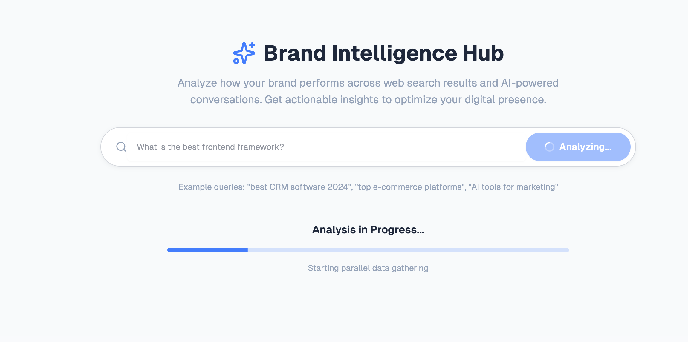
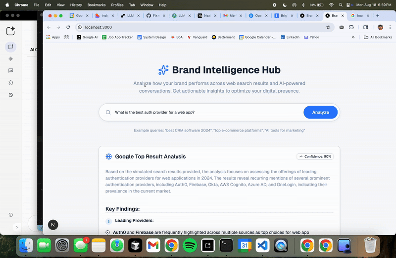
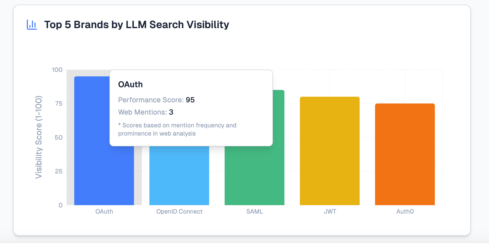

# LLM Search Insight Web App

A Next.js web application that provides intelligent search insights and analysis through integration with the LLM Search Insights API. This application allows users to submit research questions and receive comprehensive analysis reports with visualizations.

### Job Processing


### Analysis Results


### Visualization Comparison


## Features

- **Search Interface**: Submit research questions for analysis
- **Real-time Status Tracking**: Monitor job progress with live updates
- **Comprehensive Results**: View detailed analysis including web results, ChatGPT simulations, and brand visibility charts
- **Visual Analytics**: Interactive charts and visualizations for brand analysis
- **Modern UI**: Built with Next.js, TypeScript, and Tailwind CSS

## Getting Started

First, run the development server:

```bash
npm run dev
# or
yarn dev
# or
pnpm dev
# or
bun dev
```

Open [http://localhost:3000](http://localhost:3000) with your browser to see the result.

You can start editing the page by modifying `app/page.tsx`. The page auto-updates as you edit the file.

This project uses [`next/font`](https://nextjs.org/docs/app/building-your-application/optimizing/fonts) to automatically optimize and load [Geist](https://vercel.com/font), a new font family for Vercel.

## Project Structure

- **`/src/app`**: Next.js app router pages and API routes
- **`/src/components`**: React components including analysis results, charts, and search interface
- **`/src/hooks`**: Custom React hooks for API integration
- **`/src/lib`**: Utility functions and configurations
- **`/media`**: Project screenshots and demonstrations

## Learn More

To learn more about Next.js, take a look at the following resources:

- [Next.js Documentation](https://nextjs.org/docs) - learn about Next.js features and API.
- [Learn Next.js](https://nextjs.org/learn) - an interactive Next.js tutorial.

You can check out [the Next.js GitHub repository](https://github.com/vercel/next.js) - your feedback and contributions are welcome!

## Deploy on Vercel

The easiest way to deploy your Next.js app is to use the [Vercel Platform](https://vercel.com/new?utm_medium=default-template&filter=next.js&utm_source=create-next-app&utm_campaign=create-next-app-readme) from the creators of Next.js.

Check out our [Next.js deployment documentation](https://nextjs.org/docs/app/building-your-application/deploying) for more details.

---

# LLM Search Insight API Guide (v5.1)

This guide provides developers with comprehensive information to interact with the LLM Search Insight API. The API is designed to analyze research questions, providing in-depth insights and visualizations based on simulated web analysis.

**API Documentation:**
*   **Live Swagger UI:** [https://llm-search-insights-api.onrender.com/docs](https://llm-search-insights-api.onrender.com/docs)
*   **OpenAPI Spec:** [https://llm-search-insights-api.onrender.com/openapi.json](https://llm-search-insights-api.onrender.com/openapi.json)
*   **API Version:** 5.1 (OAS 3.1)

**Base URL:**
```
https://llm-search-insights-api.onrender.com```

---

### **Typical Workflow**

Interacting with the API follows a simple asynchronous pattern:

1.  **Submit Job:** Make a `POST` request to `/api/v1/analyze` with your research question. You will receive an `analysis_id`.
2.  **Poll Status:** Periodically make `GET` requests to `/api/v1/analyze/{analysis_id}/status` to check the job's progress.
3.  **Retrieve Results:** Once the status is `COMPLETE`, make a `GET` request to `/api/v1/analyze/{analysis_id}` to fetch the full report.

---

### **Endpoints**

### 1. Submit a New Analysis Job

This endpoint initiates a new analysis job by accepting a research question. The job is then queued for background processing.

-   **Method:** `POST`
-   **Endpoint:** `/api/v1/analyze`

#### Request Body

| Field | Type | Constraints | Required | Description |
| :--- | :--- | :--- | :--- | :--- |
| `research_question` | string | 10-500 characters | Yes | The research question you want to analyze. |

**Example `curl` Request:**
```bash
curl -X 'POST' \
  'https://llm-search-insights-api.onrender.com/api/v1/analyze' \
  -H 'accept: application/json' \
  -H 'Content-Type: application/json' \
  -d '{
  "research_question": "what is the best purse brand?"
}'
```

#### Responses

-   **`202 Accepted`** (Successful Response)
    *   **Description:** The job was successfully submitted and is now queued.
    *   **Body:**
        ```json
        {
          "analysis_id": "ceac7d08-c4c1-45aa-85a5-a0c9d8c26f84",
          "status": "QUEUED"
        }
        ```

-   **`404 Not Found`**
    *   **Description:** The requested resource was not found.
    *   **Body:**
        ```json
        {
          "error": "ValidationError",
          "details": {}
        }
        ```

-   **`422 Validation Error`**
    *   **Description:** The request body is invalid (e.g., `research_question` is missing or does not meet length requirements).
    *   **Body:**
        ```json
        {
          "detail": [
            {
              "loc": [ "string", 0 ],
              "msg": "string",
              "type": "string"
            }
          ]
        }
        ```

-   **`500 Internal Server Error`**
    *   **Description:** An unexpected error occurred on the server.
    *   **Body:**
        ```json
        {
          "error": "ValidationError",
          "details": {}
        }
        ```

---

### 2. Check Analysis Job Status

Poll this endpoint to get the real-time status and progress of an analysis job.

-   **Method:** `GET`
-   **Endpoint:** `/api/v1/analyze/{analysis_id}/status`

#### Path Parameters

| Parameter | Type | Required | Description |
| :--- | :--- | :--- | :--- |
| `analysis_id` | string | Yes | The unique ID returned when the job was submitted. |

#### Responses

-   **`200 OK`** (Successful Response)
    *   **Description:** Returns the current status of the job.
    *   **Body:**
        ```json
        {
          "status": "COMPLETE",
          "progress": 100,
          "current_step": "Finished",
          "error_message": null
        }
        ```

-   **`404 Not Found`**, **`422 Validation Error`**, **`500 Internal Server Error`**
    *   **Description:** These errors follow the same format as the `POST /analyze` endpoint.

---

### 3. Get Final Analysis Results

Once the job status is `COMPLETE`, use this endpoint to retrieve the full analysis report.

-   **Method:** `GET`
-   **Endpoint:** `/api/v1/analyze/{analysis_id}`

#### Path Parameters

| Parameter | Type | Required | Description |
| :--- | :--- | :--- | :--- |
| `analysis_id` | string | Yes | The unique ID for the analysis job. |

#### Responses

-   **`200 OK`** (Successful Response)
    *   **Description:** Returns the complete analysis report.
    *   **Body:** See the `FullAnalysisResult` schema below for a detailed breakdown.

-   **`404 Not Found`**, **`422 Validation Error`**, **`500 Internal Server Error`**
    *   **Description:** These errors follow the same format as the `POST /analyze` endpoint.

---

### **Schemas (Data Models)**

#### `StatusEnum`
An enumeration of all possible job statuses:
-   `QUEUED`: The job is waiting to be processed.
-   `PROCESSING`: The job has started.
-   `SCRAPING`: The web data collection phase is in progress.
-   `SYNTHESIZING`: The results are being analyzed and synthesized.
-   `COMPLETE`: The job has finished successfully.
-   `ERROR`: The job failed.

#### `FullAnalysisResult`
The main object containing the complete analysis report.
-   `analysis_id` (string)
-   `research_question` (string)
-   `status` (string): The final status (e.g., "COMPLETE").
-   `completed_at` (string, `date-time`)
-   `web_results` (WebAnalysis object)
-   `chatgpt_simulation` (ChatGPTResponse object)
-   `visualization` (VisualizationData object)

#### `WebAnalysis`
-   `source` (string)
-   `content` (string)
-   `timestamp` (string, `date-time`)
-   `confidence_score` (number)

#### `ChatGPTResponse`
-   `simulated_response` (string)
-   `identified_brands` (array of strings)

#### `VisualizationData`
-   `chart_type` (string): e.g., "bar\_chart\_brand\_visibility".
-   `title` (string)
-   `x_axis_label` (string)
-   `y_axis_label` (string)
-   `top_5_brands` (array of strings)
-   `brand_scores` (array of BrandVisibilityScore objects)
-   `methodology_explanation` (string)

#### `BrandVisibilityScore`
-   `brand_name` (string)
-   `visibility_score` (integer, `[1, 100]`)
-   `rank` (integer)
-   `mentions` (integer)
